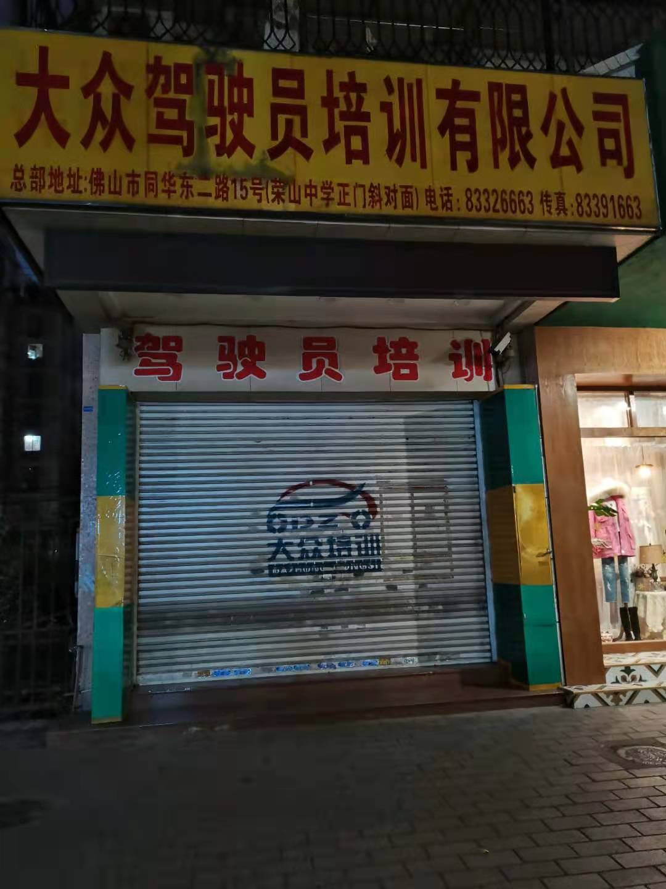
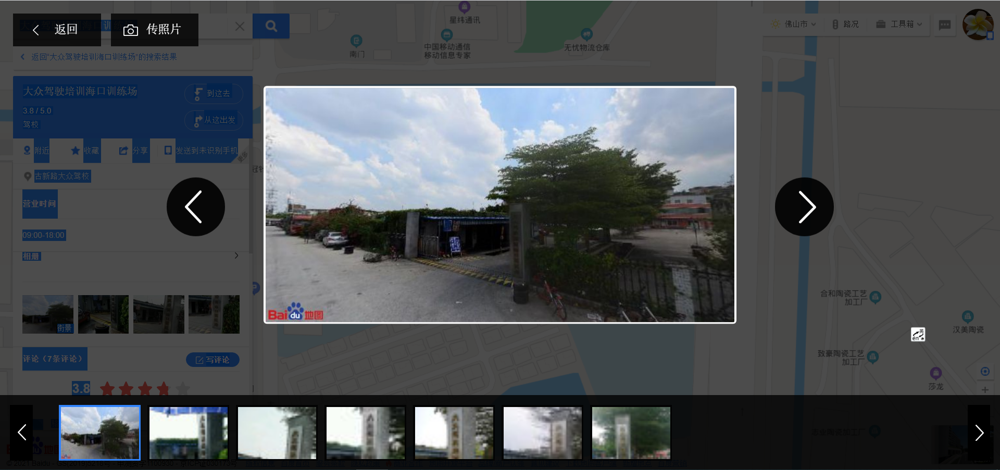
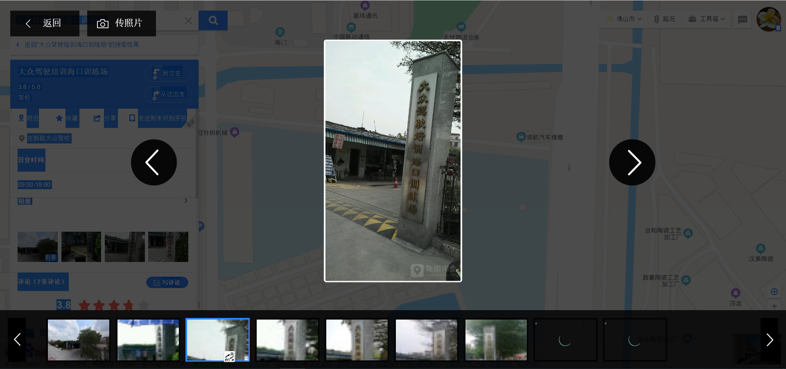
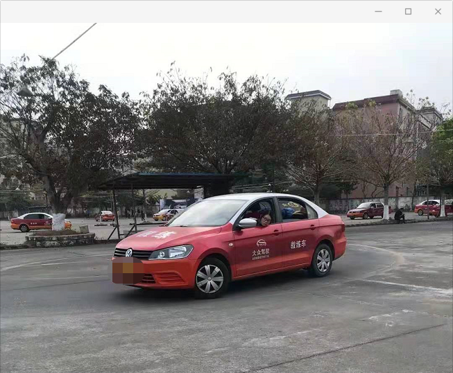
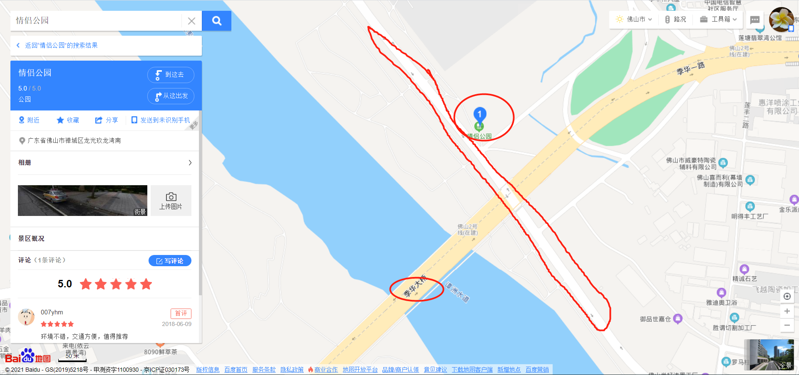
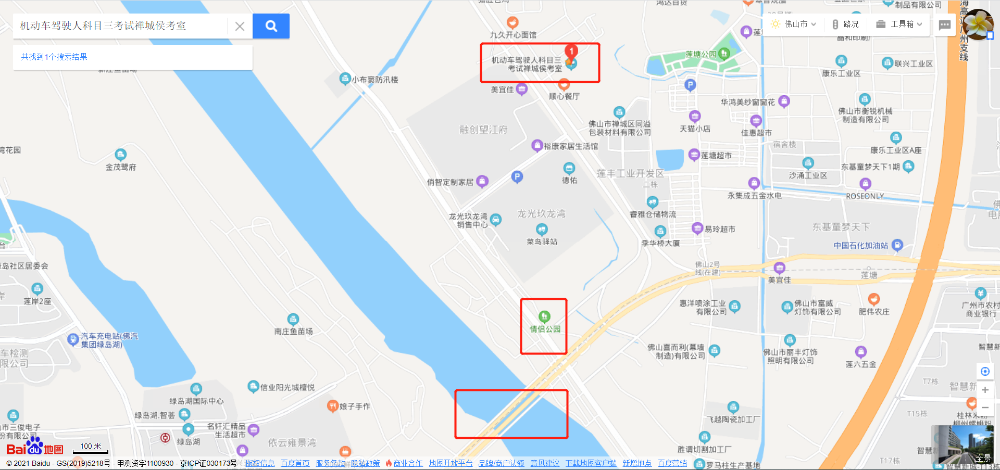
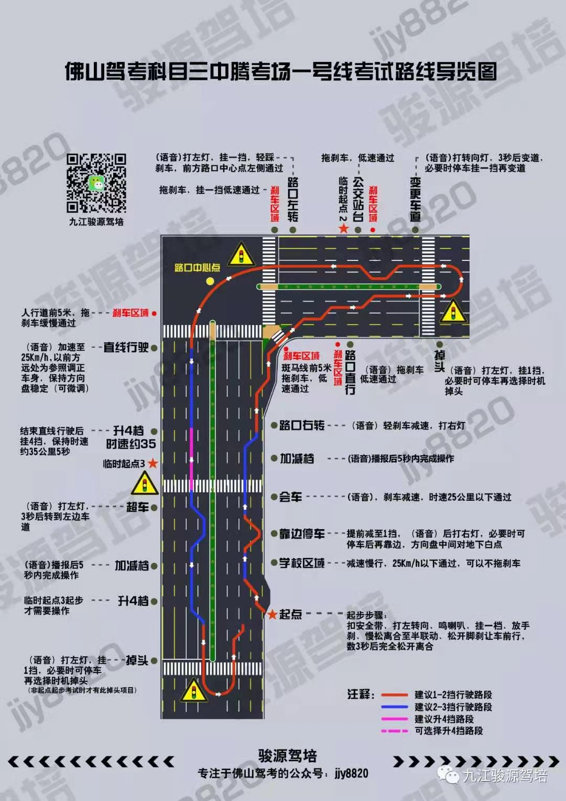
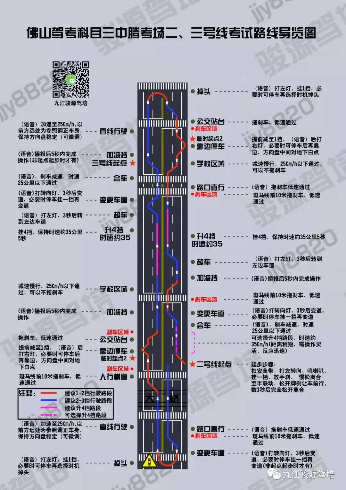

# 学车

分享关于学车的心得。

## 广告

打一波广告，如果**佛科院本部**有同学（如果毕业了也问题不大）需要学车的，可以联系我（邮箱：sheng.yan836@gmail.com）。

我特地去问了下教练，大概是3500元左右（最便宜那种，即如果第一次不合格，补考费另算的，科二200元，科三300元），自动波便宜点，手动波贵一点。

- 自动波：学得快，但是约考相对较慢（因为自动波的考试车比较少），考试难度较低（当然这里主要是指科二、科三）。
- 手动波：学得相对慢，约考比较容易，考试难度较大。

## 心得

### 好的教练

学车最关键的是啥？？？好的驾校？not，是一个好的教练，一个好的教练，一个好的教练！！！

好的驾校的教练也有不负责任的！我报的是“大众驾校”，应该算是好的驾校了吧？！但是一开始科二带我的那个教练太吊儿郎当了，考试考点都不怎么说，注意点也不说，考试时你会“死的不明不白”。哎，科二我挂了二次，后来听说他教的挂科率贼高，最近听说好像被辞退了。因此找一个好的教练很重要。

### 认真学

这个就不说了。

### 考试平常心

这个真的很重要！考试一定不要慌，一定不要慌，一定不要慌:grin:！不然容易出现细节性问题。

## 广而告之

有人可能会问：为什么一定要先联系我？直接给个教练电话不就行了吗？因为介绍都是有**介绍费**的！之前有同学就做过这个，好像是200元，这个没问，但是说了有。到时教练给我介绍费我再全部返还给你，这不香吗？

那我不就是“赔钱赚吆喝”了吗？对！哦，不，没赔钱，只是不赚钱而已。因为我之前问价钱仅仅是为了了解了解行情的，但是既然教练提了，我就帮他宣传一波，真的免费、免费、免费、免费 :kissing_heart: ！！！

### 详情

~~（ps:照片好像拍的不怎么好看，不过应该问题不大）~~

驾校名称：大众驾校（全称：大众驾驶员培训有限公司）

公司总部地址：佛山市同华东二路15号（荣山中学正门斜对面）（ps：附近地铁站为（广佛线）同济路，共享自行车好像不用10分钟）

庞教练：13112730838 （可以说是我介绍的，不说也ok，我微信昵称“**荷塘月色**”）

## 考试介绍

主要介绍各科考试地点及相关内容，特指禅城区这边的！

### 科一

#### 练习

APP刷题，比如驾考宝典。

#### 考场

仙塘考场：广东省佛山市顺德区仙塘大道19号，仙塘驾驶员考试训练场（ps：其实科二、科四也是这里）

挺远的，但是问题不大，科一科四可以搭公司的专车去，来回20元人民币（考场--公司总部），比自己去划算的多（如果是住考场附近就另说）！当然如果人少的话，可能教练开车送你，也有可以需要自己去。

### 科二

#### 练习（训练）

按照教练教的来，并且看一些APP上对应的问题或者视频等。

之前手动挡有分AB（现在不知道还分不分……），以车新旧分，新车肯定比较好开！考试的话，除了车的新旧还有就是各项目的顺序有点不同。

海口训练场：广东省佛山市禅城区，大众驾驶培训海口训练场

本部的话一般来回都接送的。

#### 考场

地点同科一，科二主要分两边，A/B。

仙塘考场：广东省佛山市顺德区仙塘大道19号，仙塘驾驶员考试训练场

### 科三-禅城中腾考场

需要在社会路段（科二是训练场练习，相对而言）**练习和考试**，一般教练会坐副驾驶，紧急情况会踩刹车。

#### 练习

**练习时间**

因为科三考试时间是周一至周六的工作时间（节假日除外），这个时间段是不能练车的（虽然偶尔有教练车出现在考场），因为会被罚。因此只能在练习时间只能是下面这些：

- 周一到周六：早上（安全员上班前，8点还是9点前）
- 周一到周六：晚上（安全员下班后，18点左右）
- 周日：不限时间

**考试路线**

有三条线：1号线，2、3号线（23号线是一起的）；两个地点间隔不远。

需要特别注意的是：每条线都有多个起点，因为侧边停车的地点也可以作为起点，因此如果中途挂了一次，然后可能就会在非常规起点开始考试！！！你可能会不太习惯，但是不要慌，做好每个项目就OK。如果挂科，语音会播报的，如果没反应就一直开。

---

难度（我的观点）：

- 1号线：比较难，路况比较复杂，但是重车相对较少。
- 23号线：比较简单，沿江线，视眼开阔，路况较好，但是重车较多。

---

地点：

- 1号线：

- 23地点：广东省佛山市禅城区龙光玖龙湾南，情侣公园（就是季华大桥旁边这个公园，这里有个厕所的，有三急可以使用）

#### 考场

介绍下科三流程：练车-->报名-->练车-->提前1个小时左右到科三候考室-->排队进（人脸识别）-->大厅坐着等车号（1-61号，1-20好像是1号线，然后后面的是23号线）-->出现车号后，如果有工作人员报车号（或者直接叫名字），出来上（考试题）车-->安全员驾车带你们到开始地点-->按照车上的顺序开始考试。

注意下：去集合地点前，先上个厕所，因为在那里只有里面有厕所，还在外面排队（即没有进到大厅）是不能进到里面上厕所的！！！因为排队时是按照时间段放行的，比如9点场，10点场这样，有时候可能需要等比较久。

分析一段视频：霸气驾考：佛山科目三中腾考场1号线全程路况踩点视频：<https://www.iqiyi.com/w_19s0zg4szh.html>

集合地点：广东省佛山市禅城区张槎街道季华北路康乐楼西300米，机动车驾驶人科目三考试禅城侯考室

看下图，熟悉不？23号线附近！！

#### 路线分析

这里的图来自“九江俊源驾培”公众号（侵删），因为有一定年代了，部分内容可能有变（比如现在没有加减档了，但是图片里面还有），仅供参考！！！！

**1号线**：佛山驾考科目三中腾考场一号线考试路线导览图

---

**23号线**：佛山驾考科目三中腾考场二、三号线考试路线导览图

### 科四

考完，合格，考场机房前台签名，出来宣誓，然后扫码，邮寄驾驶证。

#### 练习

APP刷题，比如驾考宝典。

#### 考场

仙塘考场：广东省佛山市顺德区仙塘大道19号，仙塘驾驶员考试训练场。

