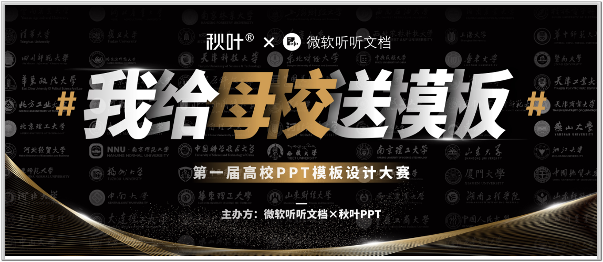

# 毕设设计PPT模板

这两个PPT模板来源于由**微软听听文档**和**秋叶PPT**主办的《我给母校送模板--第一届高校PPT模板设计大赛》。

- 佛山科学技术学院-张伟崇-毕业答辩-通用模板--一等奖

- 佛山科学技术学院-徐紫丹-毕业答辩PPT模板--二等奖

## 关于这个比赛的说明

第一届大赛是在2019年年初，因为时间有点久了，暂时也没有找到之前的官网介绍。下面是我找的两个相关链接，不知道是不是官方的，但是我觉得有一定的代表性：

- officeplus官方-参赛模板文件：<http://www.officeplus.cn/p/10/102610.shtml>。
- 秋叶PPT说明：<http://www.yidianzixun.com/article/0LZBoClC?appid=oppobrowser&s=oppobrowser> 。

### 如何获取PPT

网上流传的比较多的都是获奖作品。

1. officeplus官网：[我给母校送模板第一届ppt](<http://www.officeplus.cn/search.shtml?key=我给母校送模板第一届&cat=ppt>)
2. 非官网：PPT模板网--我给母校送模板](<http://ppt.hanhaiqikan.cn/tag/我给母校送模板>)

非官网链接：

<http://www.51pptmoban.com/zt/wogeimuxiaosongmoban/>

[我给母校送模板（第一届）专题列表](http://www.51pptmoban.com/zt/wogeimuxiaosongmoban/#)

链接：https://pan.baidu.com/s/1T1rskUlAU6-qiI2eLECRCA 
提取码：htys 
复制这段内容后打开百度网盘手机App，操作更方便哦