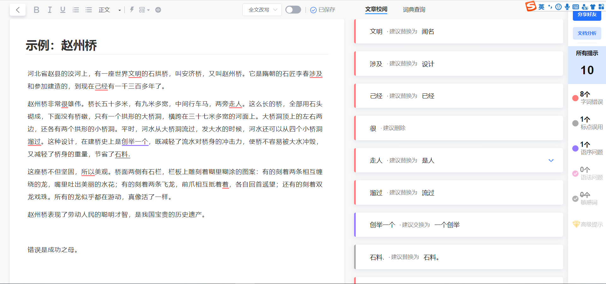

# 毕业论文相关内容

## 秘塔写作猫

<https://xiezuocat.com/>

一个在线工具，能够智能纠错、AI优化语句、翻译等。感觉AI改写内容简直就是为了“论文去重”而设计的！！！

### 插件

**秘塔写作猫是新一代AI写作伴侣，帮你推敲用语、斟酌文法、改写文风**。

本插件是秘塔写作猫的Word插件，能够让用户在编辑Word文档时也能调用写作猫强大的文档校阅功能。

用户只需要打开一篇有内容的文档，点击“刷新”，插件就会将相关文本中的语法和词语错误显示出来，并给出修改建议。使用方法简单明了，查错高效，质量可靠。

您需要使用现有秘塔写作猫账号登录或者注册。

免费版上限是10000字/天。

团队版上限是60000字/天/人，并且支持商务助手功能。需要到官方网站https://xiezuocat.com/进行升级。

商务助手功能只有团队版用户才能使用。

### 公司简介

上海秘塔网络科技有限公司成立于2018年4月，是人工智能领域的一家新锐科技公司，目前已成立北京和成都两大研发中心，拥有近30名工程师。

秘塔定位于AI x 专业场景，通过为专业人士的高频次专业场景进行技术训练（如：文书写作、法律翻译等）提供AI辅助，最大程度地提升专业人士的工作质量与效率。

#### 隐私安全

用户数据的安全性与隐私保护是我们的首要考虑。在数据传输层面，秘塔写作猫使用行业标准的TLS加密协议，即基于 HTTPS的安全通信协议来保护传输中的用户数据。TLS可以防止攻击者在服务器和客户端之间捕获传输中的数据。在数据存储时，用户文件由512位RSA非对称加密算法进行保护，并存储在全磁盘加密的专有文件服务器上。我们的访问控制模型确保了用户只能访问自己拥有的文件。具体的隐私政策请见《写作猫隐私政策》

#### 联系方式

联系电话：+86 15901025282

上海总部地址：上海市浦东新区南汇新城镇环湖西二路888号C楼

联系客服

## 参考文献

**参考文献(即引文出处)的类型以单字母方式标识：**

M——专著，

C——论文集，

N——报纸文章，

J——期刊文章，

D——学位论文，

R——报告，

S——标准，

P——专利;

对于不属于上述的文献类型，采用字母“Z”标识。

### 参考文献在线生成器

- 参考文献自动生成器：<http://www.lunwenstudy.com/ckwx/>
- 论文格式大师：<http://wenxian.aazz.cn/>